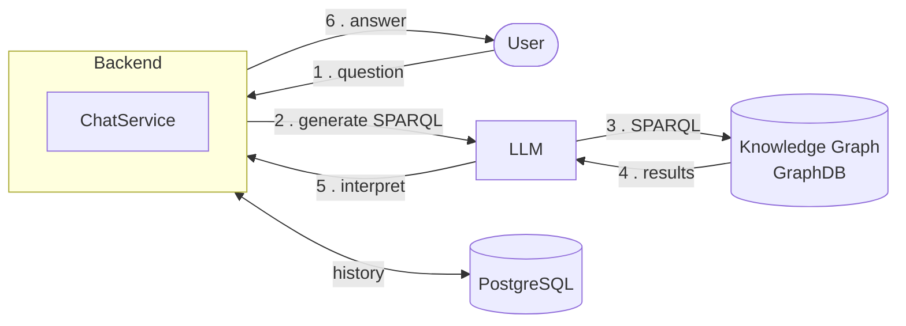
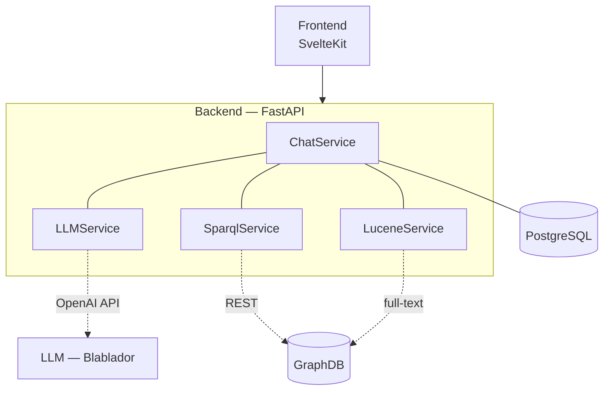
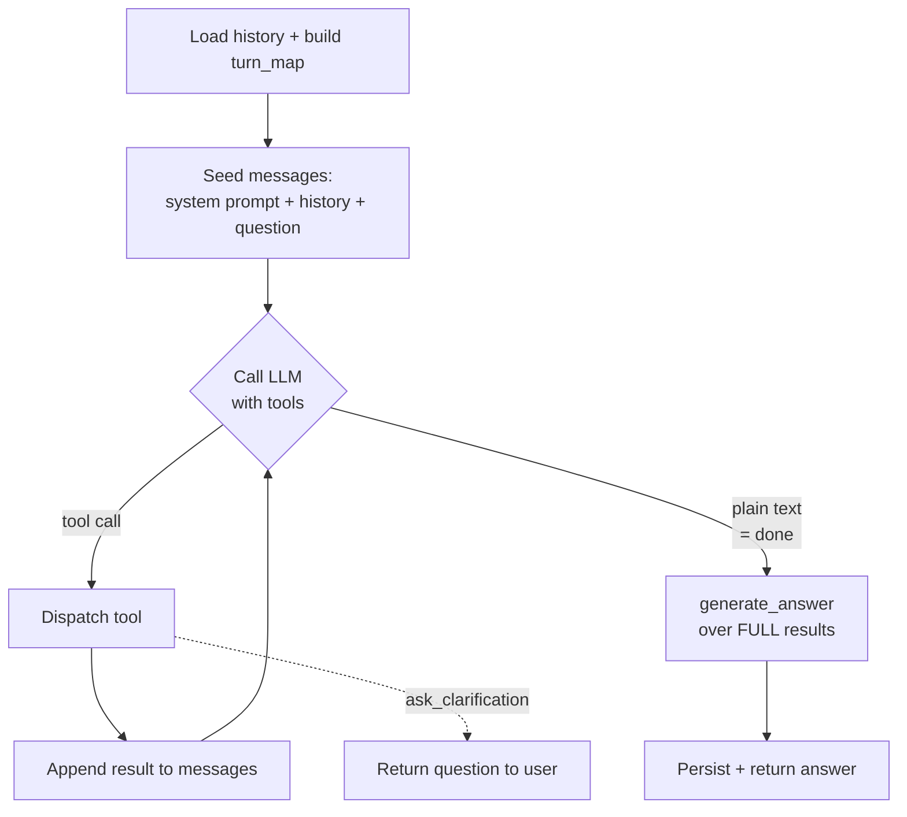
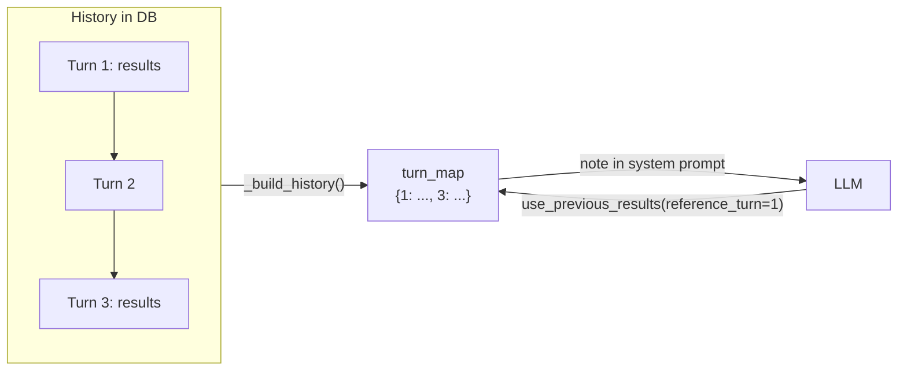
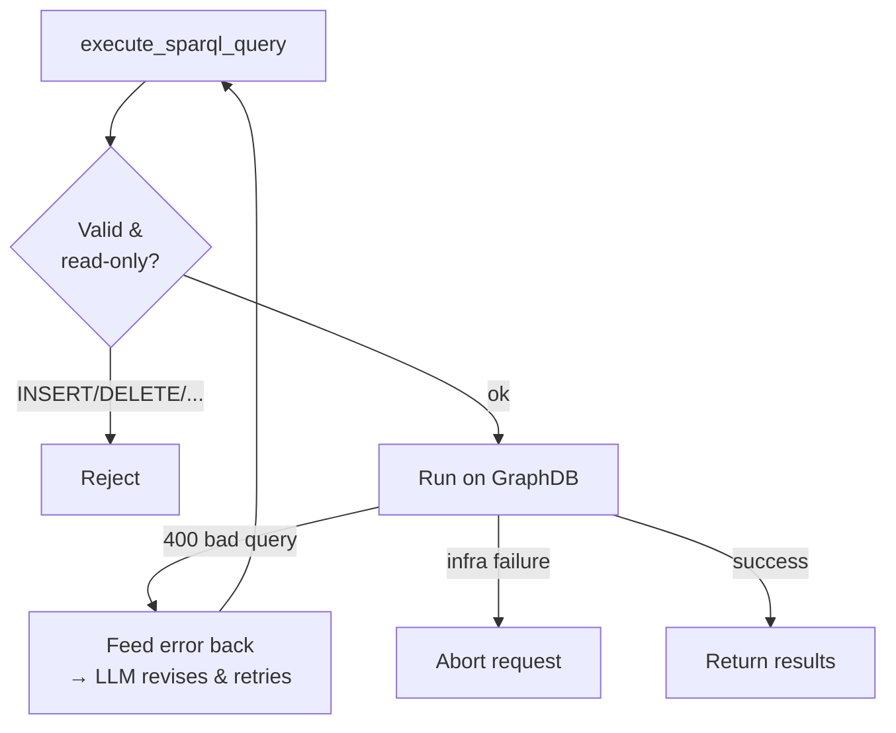
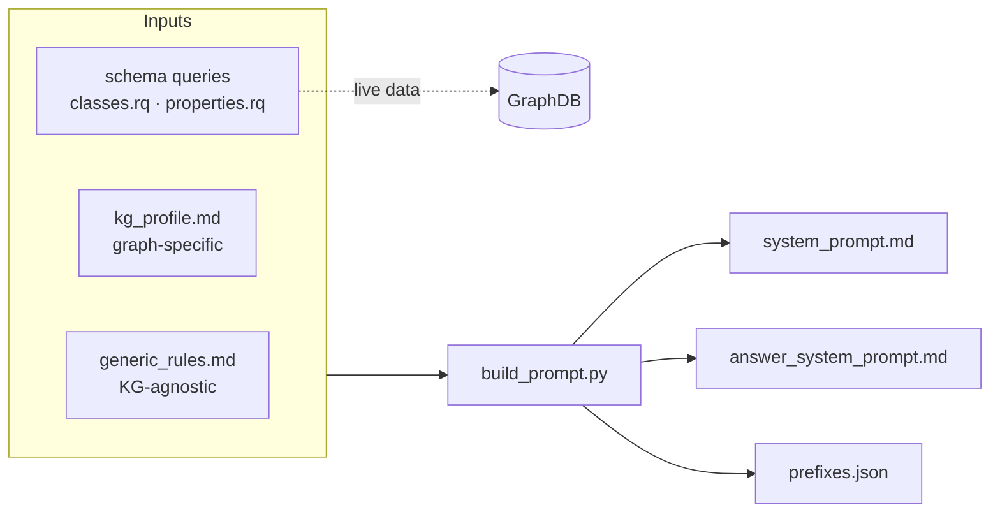
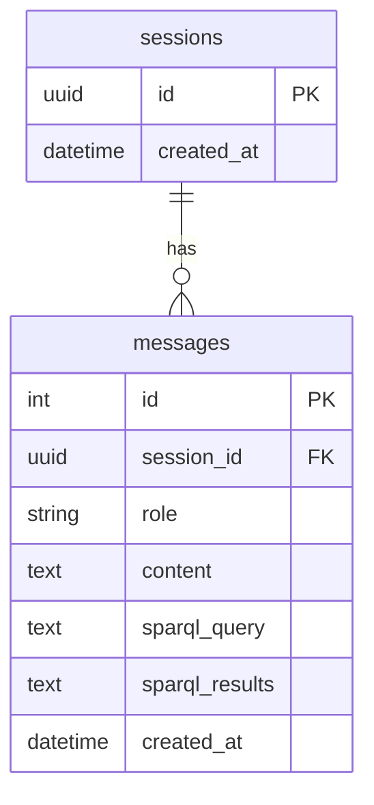

<style>
.slidev-layout {
  background: #ffffff;
  color: #000000;
}
.slidev-layout h1,
.slidev-layout h2,
.slidev-layout h3 {
  color: #000000;
}
/* Divider line between heading and content on content slides */
.slidev-layout.default h1 {
  border-bottom: 2px solid #000000;
  padding-bottom: 0.4rem;
  margin-bottom: 1.4rem;
}
/* No divider on the cover / centered / section slides */
.slidev-layout.text-center h1 {
  border-bottom: none;
  padding-bottom: 0;
}
</style>


# DataExplorer

## Natural-language questions over a biodiversity knowledge graph

<div class="opacity-70 mt-8">Backend Architecture — SWEP</div>

<!--
Intro: this talk focuses on the backend. The frontend exists but is owned by another team and out of scope here.
-->

---
layout: center
zoom: 0.8
---

# The Idea

<div class="text-xl leading-relaxed">

Ask in **plain English** —
no knowledge of SPARQL or the graph schema required.

</div>

<v-clicks>

- The data lives in a **knowledge graph** (plant phenology in botanical gardens)
- Users shouldn't have to learn a query language to explore it
- An **LLM translates** the question into SPARQL, runs it, and explains the result

</v-clicks>

<!--
Goal: lower the barrier. The graph holds rich biodiversity data, but querying it normally means writing SPARQL. We let an LLM do that translation.
-->

---
zoom: 0.8
---

# How it works — the big picture



<div class="text-sm opacity-70 mt-4">

The LLM is used **twice**: first to write the query, then to turn raw results into a readable answer.

</div>

<!--
Walk the numbered arrows. Emphasize the round trip: question -> query -> graph -> results -> answer. The DB stores conversation history alongside.
-->

---
zoom: 0.8
---

# The components

<div class="flex justify-center items-center gap-4">

<div>



</div>

<div class="text-sm">

| Component | Role |
|---|---|
| **Frontend** | UI — asks questions, renders answers *(other team)* |
| **Backend** | Orchestration: the tool loop, query exec, persistence |
| **LLM** | Translates NL → SPARQL, interprets results |
| **Knowledge Graph** | The biodiversity data (GraphDB) |
| **Database** | Sessions + chat history (PostgreSQL) |

</div>

</div>

<!--
The backend is the orchestrator. Each service has one job. Lucene runs over the same GraphDB for entity lookup.
-->

---
zoom: 0.8
---

# Tech stack

| Layer | Technology | Notes |
|---|---|---|
| Backend | **FastAPI** (Python, async) | `httpx`, async SQLAlchemy |
| Frontend | **SvelteKit 5** | Svelte 5 runes |
| Database | **PostgreSQL** | via Docker Compose |
| LLM | **Blablador** | free for the university, used through the standard **OpenAI Python SDK** + API key |
| Knowledge Graph | **GraphDB** | SPARQL over a REST endpoint |

<div v-click class="mt-6 p-4 border rounded">

**Generic by design** — the LLM model **and** the SPARQL endpoint are just `.env` config.
Point it at a different graph, regenerate the prompts, and it works on new data.

</div>

<!--
Key selling point: nothing is hardcoded to one model or one graph. Blablador speaks the OpenAI API, so swapping to OpenAI/another provider is a config change.
-->

---
zoom: 0.8
---

# Backend API — overview

All routes under `/api/v1`

| Method | Path | Purpose |
|---|---|---|
| `POST` | `/chat/` | NL question → agentic answer |
| `GET` | `/chat/models` | list available LLM models |
| `GET` | `/chat/full_table` | fixed tabular view — **no LLM** |
| `GET` | `/session/{id}/history` | read chat history |
| `PUT` | `/session/{id}/history` | replace history |
| `DELETE` | `/session/{id}` | delete session (+ messages) |
| `GET` | `/health/` | aggregate health (GraphDB + LLM) |

<!--
Three routers: chat, session, health. full_table is interesting - a pre-baked query with no LLM, for a default data view.
-->

---
zoom: 0.8
---

# Backend API — examples

<div class="grid grid-cols-2 gap-4">

<div>

**Request** — `POST /api/v1/chat/`

```json
{
  "message": "Which gardens recorded
     first flowering of
     Achillea millefolium?",
  "session_id": null
}
```

</div>

<div>

**Response**

```json
{
  "answer": "Three gardens recorded ...",
  "session_id": "a1b2-...-uuid",
  "llm_generated_query": "SELECT ?g ...",
  "sparql_query_result": "{ ... }"
}
```

</div>

</div>

<div class="mt-4">

**`GET /api/v1/health/`** →

```json
{ "status": "ok | degraded | down",
  "services": { "sparql_service": {...}, "llm_service": {...} } }
```

</div>

<!--
session_id is null on the first turn, then reused for follow-ups. The response carries both the generated query and the raw results for transparency / the frontend.
-->

---
layout: section
zoom: 0.8
---

# Deep dive
## How a SPARQL query gets generated

<!--
This is the core of the backend. The next slides break down the agentic tool loop.
-->

---
zoom: 0.8
---

# The agentic tool loop



<div class="text-sm opacity-70 mt-2">

Bounded by `chat_max_tool_iterations`. The model keeps calling tools until it has enough data, then writes plain text → that ends the loop.

</div>

<!--
Emphasize: it's a loop, not a single shot. The LLM decides each step. Final answer is a SEPARATE call so it sees the full, untruncated results.
-->

---
zoom: 0.8
---

# The tools the LLM can call

| Tool | What it does | Key params |
|---|---|---|
| `resolve_entity` | look up the real **URI** for a name via full-text search over `rdfs:label` | `term`, `type?`, `limit?` |
| `execute_sparql_query` | run a new SPARQL `SELECT` / `ASK` | `query` |
| `use_previous_results` | reuse an earlier turn's results — no re-query | `reference_turn` |
| `ask_clarification` | ask the user when the question is ambiguous | `question` |
| `load_phenobs_papers` | load PhenObs paper excerpts into context | *(none)* |

<div v-click class="mt-4 text-sm">

`resolve_entity` exists so the LLM **never guesses URIs** — it looks them up first.

</div>

<!--
Five tools, each a small JSON definition. resolve_entity is the trick that keeps queries grounded in real IDs. ask_clarification is the only one that ends the loop without a query.
-->

---
zoom: 0.8
---

# Context handling during generation



<div class="grid grid-cols-2 gap-4 mt-4 text-sm">

<div>

**Avoiding context explosion**
- Results re-injected into the loop are **truncated** (~30 rows)
- The **full** result set is kept aside

</div>

<div v-click>

**…without losing data**
- The final `generate_answer()` call uses the **complete** results
- So the answer is always based on everything

</div>

</div>

<!--
turn_map maps turn numbers to past results so the LLM can say "reuse turn 1". Truncation keeps the loop cheap; the full data is only spent on the final answer.
-->

---
zoom: 0.8
---

# Robustness & error handling



<div class="grid grid-cols-2 gap-4 mt-3 text-sm">

<div>

- **Read-only safety** — mutating queries rejected
- Unbounded `SELECT`s get an auto `LIMIT`

</div>

<div>

- **Bad query → retry** inside the loop
- `/health/` aggregates GraphDB + LLM
- Recovers tool calls emitted as plain text

</div>

</div>

<!--
The distinction matters: a bad query is the LLM's fault and recoverable -> feed it back. An infrastructure failure is not -> abort cleanly. Validation guarantees we never mutate the graph.
-->

---
zoom: 0.8
---

# System prompt — generic & regenerable



<div class="mt-4 text-sm">

The schema (classes, properties, prefixes) is **extracted live from the data** — not hardcoded.
Only the two `kg_*` profiles are graph-specific. **Switch graphs → edit profiles → re-run.**

</div>

<!--
build_prompt.py is run manually whenever the graph changes. It introspects the actual data for the schema, so the prompt always matches reality. This is what makes the project portable.
-->

---
zoom: 0.8
---

# Database & history

<div class="grid grid-cols-2 gap-6">

<div>



</div>

<div class="text-sm">

**History system**

- Every user + assistant message is **persisted**
- Assistant rows also store the **query + results**
- A request loads a sliding window: `chat_history_depth` turns
- `ON DELETE CASCADE` — drop a session, its messages go too
- Indexed on `(session_id, created_at)`

</div>

</div>

<!--
Two tables only. Storing query+results per assistant message is what makes use_previous_results possible across turns. History depth bounds how much context we replay.
-->

---
layout: center
zoom: 0.8
---

# Testing

<div class="grid grid-cols-3 gap-8 mt-8 text-center">

<div>
<div class="text-6xl font-bold">97</div>
<div class="opacity-70">tests</div>
</div>

<div>
<div class="text-6xl font-bold">11</div>
<div class="opacity-70">test files</div>
</div>

<div>
<div class="text-6xl font-bold">~1.1k</div>
<div class="opacity-70">lines of test code</div>
</div>

</div>

<div class="mt-10 opacity-70">pytest + pytest-asyncio — services, tool loop, error paths</div>

<!--
Roughly one line of test for every two lines of source. The tricky parts - the tool loop branches and error handling - are covered.
-->

---
zoom: 0.8
---

# Challenges & lessons learned

<v-clicks>

- **Context explosion** — big result sets blow up the loop
  → truncate in-loop, keep full results only for the final answer

- **Models emit tool calls as plain text** — not all support structured tool calling
  → a recovery layer parses them back into real tool calls

- **Don't let the LLM guess URIs** — it hallucinates identifiers
  → `resolve_entity` grounds every entity via Lucene first

- **Queries fail** — and that's fine
  → feed the error back so the model fixes its own query

</v-clicks>

<!--
These are the real-world problems that shaped the design. Each one maps to a concrete mechanism in the code.
-->

---
layout: center
zoom: 0.8
---

# Fun facts

<div class="grid grid-cols-2 gap-x-12 gap-y-5 mt-6 text-lg">

<div><b>~2,110</b> lines of backend Python</div>
<div><b>~1,100</b> lines of tests · <b>97</b> tests</div>
<div><b>~4,880</b> lines of frontend</div>
<div><b>~750</b> lines of prompts/templates</div>
<div><b>5</b> LLM tools · <b>44</b> dependencies</div>
<div><b>25</b> backend source files</div>
<div><b>90</b> commits · <b>9</b> contributors</div>
<div>started <b>Apr 21, 2026</b></div>

</div>

<!--
Light moment. The frontend is actually bigger in LOC, but the backend punches above its weight in complexity.
-->

---
zoom: 0.8
---

# Outlook — what's next

<v-clicks>

- **Better planning** — let the model plan multi-step reasoning before querying

- **Smarter context handling** — selective history, summarization instead of a fixed window

- *(add your own roadmap items here)*

</v-clicks>

<!--
Fill the third bullet with your concrete plans before the talk. Frame these as natural next steps, not missing features.
-->

---
layout: center
class: text-center
zoom: 0.8
---

# Thank you

## Questions?

<div class="opacity-60 mt-6">DataExplorer — Biodiversity Q&A</div>
